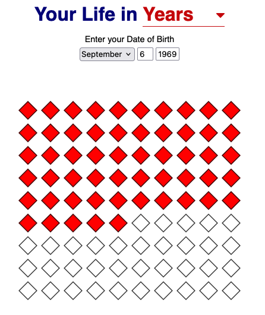

# Your Life in X



## Overview

**Your Life in X** is an embedded Rust project that displays a visual timeline of your life on an **e-paper display**.
Inspired by [Bryan Braun's Your Life in Weeks](https://www.bryanbraun.com/your-life), this project renders a similar visualization on an tricolor **e-ink display** using an **ESP32-C3** microcontroller. The goal is to provide a tangible, always-on representation of life's progress, leveraging embedded Rust as a learning experience.

## Hardware

This project runs on:

- **Microcontroller**: [ESP32-C3](https://wiki.luatos.org/chips/esp32c3/board.html)
- **E-Paper Display**: [WeAct Studio 2.9-inch](https://github.com/WeActStudio/WeActStudio.EpaperModule)
- **E-Paper Driver Library**: A fork of [`weact-studio-epd`](https://github.com/avsaase/weact-studio-epd), modified for 2.9-inch display development

### Wiring Connections

| E-Paper Pin | ESP32-C3 Pin |
|-------------|--------------|
| DC          | 21           |
| RST         | 22           |
| BUSY        | 23           |
| CS/SS       | 15           |
| SCK         | 6            |
| MISO        | Not used     |
| MOSI        | 7            |

## Project Structure

```
your-life-in-x/
├── esp/                      # ESP32-C3 firmware
├── simulation/               # Desktop simulation version
├── weact-studio-epd/         # Fork of EPD driver
├── your-life-in-x/           # Core logic for rendering the life timeline
├── docs/                     # Documentation and images
└── flake.nix                 # Nix-based development setup
```

## Dependencies

This project is written in **Rust** and leverages several embedded development crates:

- [`embedded-graphics`](https://docs.rs/embedded-graphics/) – Drawing primitives for e-ink displays
- [`display-interface-spi`](https://docs.rs/display-interface-spi/) – SPI interface for the display
- [`embedded-hal`](https://docs.rs/embedded-hal/) – Abstraction for embedded hardware interfaces
- [`esp-hal`](https://github.com/esp-rs/esp-hal) – ESP32 hardware abstraction layer
- [`weact-studio-epd`](https://github.com/avsaase/weact-studio-epd) – E-paper display driver (forked for 2.9-inch support)

## Building & Running

You can use the nix flake present in the project or install:

- Rust toolchain (install via [`rustup`](https://rustup.rs/))
- `cargo-espflash` for flashing the firmware

### Flashing to ESP32-C3

1. Install dependencies:
   ```sh
   rustup target add riscv32imc-unknown-none-elf
   cargo install cargo-espflash
   ```

2. Clone the repository and navigate to the ESP firmware directory:
   ```sh
   git clone https://github.com/jmarcelomb/your-life-in-x.git
   cd your-life-in-x/esp
   ```
3. Flash the firmware:
   ```sh
   cargo run --release /dev/ttyUSB0
   ```
   *(Replace `/dev/ttyUSB0` with the correct serial port.)*

### Running the Simulation

For quick development and testing, you can run a **simulation version** on your PC:

```sh
cd simulation
cargo run
```

## Why This Project?

I created **Your Life in X** as a hands-on **embedded Rust** project to improve my skills and explore real-world applications of Rust in microcontroller-based systems.
This project combines **low-power hardware**, **SPI communication**, and **graphics rendering** to bring a simple but thought-provoking visualization to life.

## License

This project is licensed under **MIT OR Apache-2.0**, following the same dual-license model as Rust itself.

